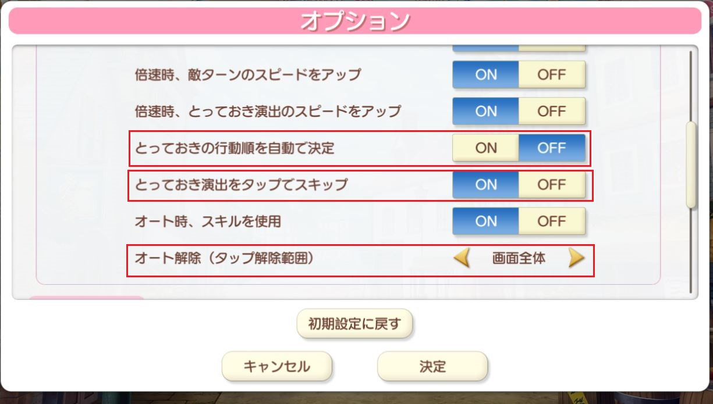
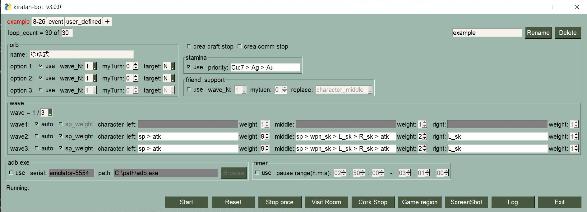
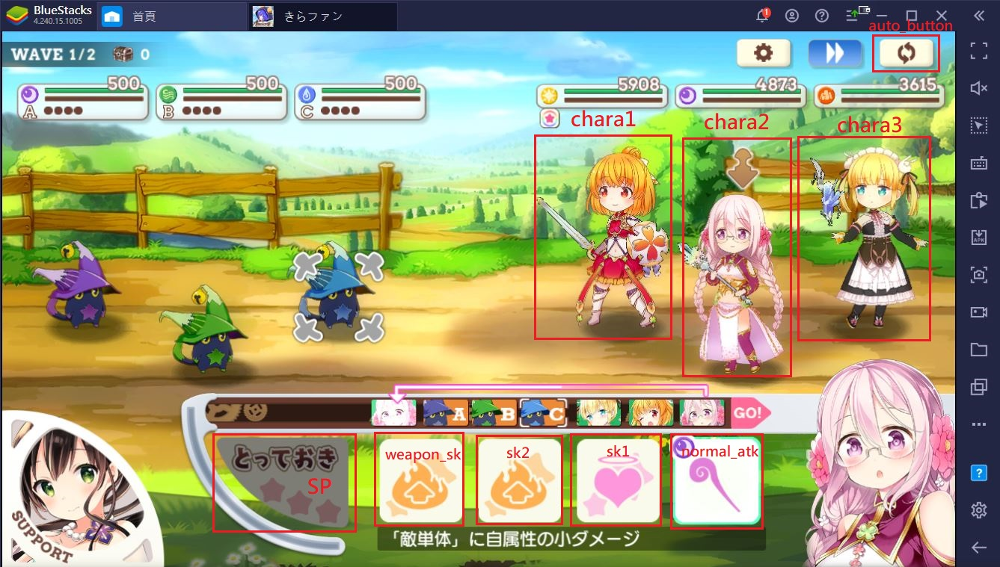

[](https://github.com/smallbomb/kirafan-bot/blob/master/LICENSE)
[](https://github.com/smallbomb/kirafan-bot/graphs/commit-activity)
[](https://github.com/smallbomb/kirafan-bot/releases)


# Kirafan-bot on emulator
Social game [kirarafantasia](https://kirarafantasia.com/) bot. Automatic training skill, weapon skill, and sp(とっておき) level. It is easy to configure kirafan-bot settings by using GUI. Kirafan-bot is like auto click tool. But, if you want to run bot on background, we also support [adb(Android Debug Bridge)](#support-adb-tool) tool.  

[kirarafantasia遊戲](https://kirarafantasia.com/)機器人。可以自動訓練技能、武器技能、珍藏(とっておき)，可以簡單地透過圖形化介面去設定bot。如果想要在背景執行kirafan-bot，也支援[adb(Android Debug Bridge)](#support-adb-tool)工具。

# Feature
1. 針對性練技(芳文跳、武器...等)
2. 刷簡易關卡 (手順不會變化的關卡)
3. 自動續關
4. 自動使用回體道具
5. 可設定當天暫停時間(如:AM:03:50-04:01暫停bot)
6. 偵測session clear
7. 偵測作品珠任務
8. 偵測遊戲crash，並嘗試回到戰鬥中 (**Note: 如果戰鬥結束時發生時，則無法回復**)
9. 拜訪好友房間3次
10. 自動交換素材 (**Note: 只支援強化和進化素材和開寶箱**)
11. 截遊戲畫面功能
12. 偵測訓練場項目
13. 戰鬥完成後，可開始偵測訓練場課程

# Frequently used quest
* [○○修練場](https://wiki.kirafan.moe/#/questlibrary/3502) (**recommend**👍)
* [ゆゆ式 (作家クエスト)](https://wiki.kirafan.moe/#/quest/5004290)
* [New Game (作家クエスト)](https://wiki.kirafan.moe/#/quest/5001270)
* [外傳14-15節](https://wiki.kirafan.moe/#/quest/1108640)
* [6-31](https://wiki.kirafan.moe/#/quest/1106310)
* [8-26(rank up)](https://wiki.kirafan.moe/#/quest/1108261)
* [チノ專武關卡](https://wiki.kirafan.moe/#/quest/43001200)

please refer to [おすすめスキル上げ](https://wikiwiki.jp/kirarafan/%E3%81%8A%E3%81%99%E3%81%99%E3%82%81%E3%82%B9%E3%82%AD%E3%83%AB%E4%B8%8A%E3%81%92)


# Installation
Download [**.exe**](https://github.com/smallbomb/kirafan-bot/releases) file for windows user   
#### or
Download [**Python**](https://www.python.org/) and kirafan-bot [**source code**](https://github.com/smallbomb/kirafan-bot/releases)
```bash
# kirafan-bot requires Python version >= 3.8
pip install -r requirements.txt
py src
```

# Suggest option


# Kirafan-bot mode
1. Hotkey mode
2. GUI mode (**default**)

please modify the [advanced_setting.jsonc](./advanced_setting.jsonc) file if you want to change kirafan-bot mode.

## Hotkey mode
* z+1~z+9 (record position and rgb)
* z+r (run/resume battle)
* z+s (stop kirafan-bot)
* z+o (stop kirafan-bot after current battle is completed)
* z+l (bot_setting.json and advanced_setting.jsonc reload)
* z+m (monitor mode)
* z+t (test to find all objects and icons)
* z+p (print position01~09)
* z+c (check/add icon file)
* z+x (open game region window for adjusting location)
* z+k (switch adb/pyautogui mode)
* z+v (visit friend room three times)
* z+e (exchenge material) ('強化素材' or '進化素材' or 'treasure chest' only)
* z+i (screenshot)
* z+n (scan training)

## GUI mode
  

* `crea craft stop`: stop kirafan-bot when crea craft mission appeared
* `crea comm stop`: stop kirafan-bot when crea comm mission was completed.
* `Start`: for battle
* `Reset`: reload/reset setting (Note: click 'Start' or 'Reset' button for the changes to take effect)
* `Stop once`: stop bot after current battle is completed
* `Visit Room`: visit friend room three times. (**First, please move to room**)
* `Cork Shop`: auto to exchenge material ('強化素材' or '進化素材' or 'treasure chest' only) (**First, please move to cork shop then select material category**)
* `Game region`: open a window for emulator location
* `ScreenShot`: capture a game region
* `Log`: show/hide log area
* `More settings`: show/hide more settings
* `Scan Training`: watch and report training course

# Glossary

* `sp` => とっておき
* `orb` => オーブ
* `stamina` => スタミナ
* `atk` => attack
* `R_sk`=> right skill
* `L_sk` => left skill
* `wpn_sk` => weapon skill

# Support adb tool
* [**about adb**](https://developer.android.com/studio/command-line/adb)
* [**download page**](https://developer.android.com/studio/releases/platform-tools)
* [**how to get device serial number**](https://developer.android.com/studio/command-line/adb#directingcommands)
* Suggest set `1280x720` resolution on emulator. But you want to set other resolution, please modify "emulator_resolution" value in [bot_setting.json](./bot_setting.json) file 

# Major 3rd party library
* [**keyboard**](https://pypi.org/project/keyboard/)
* [**PyAutoGUI**](https://pypi.org/project/PyAutoGUI/)
* [**openCV**](https://pypi.org/project/opencv-python/)
* [**PySimpleGUI**](https://pypi.org/project/PySimpleGUI/)

# Question or Suggestion👍
有任何問題或想法可以[**直接發問**](https://github.com/smallbomb/kirafan-bot/issues)，或者私訊息到twitter帳號@rockon590

if any question which is usage, bot description or idea, you can open a [**new issue**](https://github.com/smallbomb/kirafan-bot/issues) or send message to me (Twitter account: @rockon590)

**Support language: Chinese, English, Japanese** 
