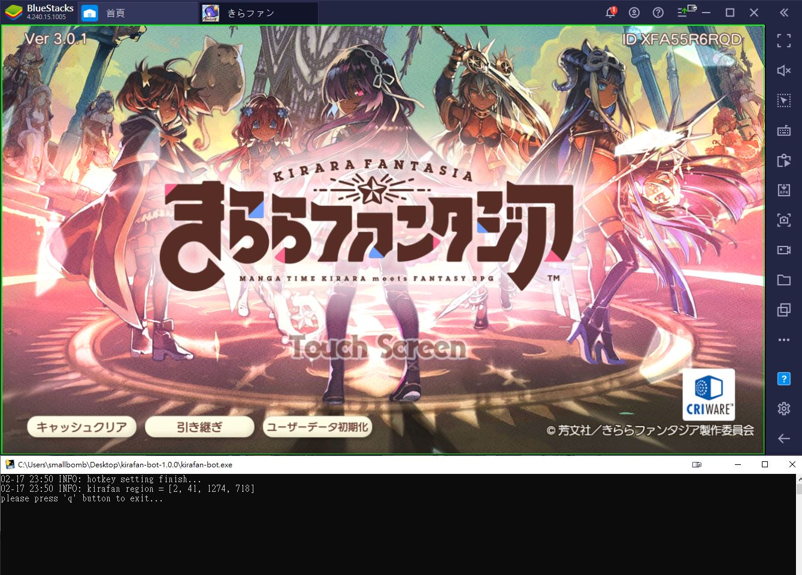
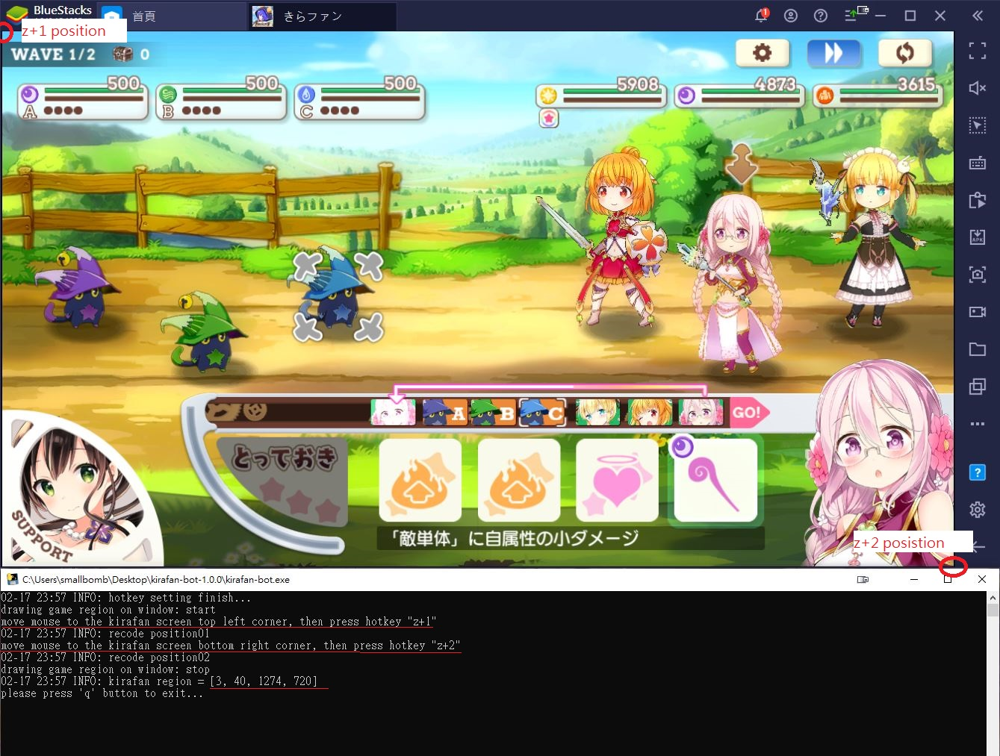

# Kirafan-bot on emulator
[kirarafantasia遊戲](https://kirarafantasia.com/)機器人。  
可以針對性練技(芳文跳、武器...等)、自動接關、可設定當天開始時間(如:AM:04:00後再開始執行)、偵測session clear、偵測作品珠任務、自動喝水...  

Social game [kirarafantasia](https://kirarafantasia.com/) bot. Automatic training skills or sp(とっておき) level

# Installation
windows 使用者可以[**點擊這裡**](https://github.com/smallbomb/kirafan-bot/releases)下載exe檔案來使用  
#### or
Python version >= 3.8  
download [**source code**](https://github.com/smallbomb/kirafan-bot/releases)
```
py install.py
py main.py
```

# BOT hotkey
* z+1~z+9 (record position and rgb)
* z+r (run bot)
* z+p (pause bot)
* z+s (stop bot)
* z+l (setting.json reload)
* z+m (monitor mode)
* z+t (test objects and icons exist?)
* z+w (print position01~09)
* z+c (check/add icon file)
* z+x (open/close game region checking) --for windows system

# Tutorialtips
## step1
windows使用者可以用z+x叫出一個綠色框矩陣，接著將遊戲視窗調整到接近綠色框大小  
ex:

**又或者**  
先將settion.json的game_region設為[0, 0, 1, 1]  
再開啟exe程式，透過內建的互動式來設定game region  
ex:

## step2
建議遊戲內的option設定如下

## step3
根據個人需求編輯[setting.json](#settingjson-description)
## step4
按下熱鍵  
* z+l (reload settion.json)
* z+r (run bot)

# setting.json description
```js
{
  "loglevel": "info",                // 可以設定loglevel: debug, info, warning, error, critical。**更改設定時需要重新啟動bot程式才會生效
  "img_dir": "img_1274x718",         // 判斷圖片的素材位置 (目前比較適用於1274x718 模擬器視窗大小)
  "game_region": [2, 41, 1274, 718], // 設定遊戲區域，不滿意可以設定[0,0,1,1]後重新調整(執行bot有互動教學)
                                     // 若重新啟動，1274x718的圖片可能不適用，需換一個img_dir，並重新shotscreen(執行bot有互動教學(z+c))
  "aspect_ratio": "16:9",            // 模擬器視窗比例
  "common_confidence": 0.8,          // 圖片的相似度調整(0.0~1.0)越高代表判斷門檻越高，可參考opencv document
  "mouse_duration_seconds": 0.1,     // 滑鼠移動的時間
  "crea_stop": false,                // 遇到作品珠任務時是否要停止bot
  "loop_count": 0,                   // loop幾次 (不包含當前回合)
  "set_timer": {                     // 定時器
    "used": false,                   // 是否用定時器?
    "time": "03:01:00",              // 時間
    "session_check": false            // 是否偵測session clear。約AM 04:00 JST時，遊戲server會清除session
  },
  "sleep": {                         // 延遲時間(s) 根據電腦效能可調整，會導致bot判斷上變快或變慢(不一定)
    "click": 0.2,                    // 滑鼠click延遲時間(建議>=0.2)
    "sp": 7,                         // 芳文跳(とっておき)延遲時間
    "loading": 9,                    // 接關時的延遲時間。
    "wave_transitions": 2            // 切換場景的延遲時間。
  },
  "stamina": {                       // 回復道具(錶)
    "used": false,                   // 是否使用?
    "count": 2,                      // 使用數量
    "priority": ["Cu", "Ag", "Au"]   // 銅:Cu, 銀:Ag, 金:Au (可以只填一種 如: ["Ag"])
  },
  "wave": {
    "grayscale": true,               // 灰階模式。可參考opencv document
    "confidence": 0.94,              // 相似度。可參考opencv document
    "total": 3,                      // 此關有幾個wave
    "1": {                           // wave1的戰鬥模式
      "auto": false,                 // 使否全自動?
      "sp_weight_enable": true,      // 是否依照sp的權重來分配sp使用。若否，則有sp時直接使用且不保留sp能量。
      "character_1": {               // 角色1
        "skill_priority": ["sk1", "sk2"],   // 技能施放優先順序 sk1 > sk2
                                            // 可以為空[]，目前有'sk1'、'sk2'、'weapon_sk'、'sp'、'normal_atk'、'auto_button'
                                            // **基本上'normal_atk'和'auto_button'必定會使用
                                            // **空[]或沒其他技能可使用時會用'auto_button'
        "sp_weight": 1                      // 權重越高代表sp使用次數會越多
      },
      "character_2": {
        "skill_priority": ["sp", "sk1", "sk2"],
        "sp_weight": 1
      },
      "character_3": {
        "skill_priority": ["sp", "sk1", "sk2"],
        "sp_weight": 1
      }
    },
    "2": {
      "auto": false,
      "sp_weight_enable": true,
      "character_1": {
        "skill_priority": ["auto_button", "normal_atk"],
        "sp_weight": 1
      },
      "character_2": {
        "skill_priority": ["sp", "sk1", "sk2"],
        "sp_weight": 1
      },
      "character_3": {
        "skill_priority": ["sp", "sk1", "sk2"],
        "sp_weight": 1
      }
    },
    "3": {
      "auto": false,
      "sp_weight_enable": false,
      "character_1": {
        "skill_priority": ["auto_button", "normal_atk"],
        "sp_weight": 1
      },
      "character_2": {
        "skill_priority": ["sp", "sk1", "sk2"],
        "sp_weight": 1
      },
      "character_3": {
        "skill_priority": ["sp", "sk1", "sk2"],
        "sp_weight": 1
      }
    }
  },
  "ratio": { // 主要用於開發者or需要更換比率的使用者
    "16:9": { // 模擬器16:9解析度
      // x,y 是座標在模擬器中的相對位置 (可用快捷建z+m或z+1~9偵測或紀錄)
      "focus_ch1": {"x":0.64460, "y":0.19032, "color":"bronze", "owner": ["character"]},
      "focus_ch2": {"x":0.77902, "y":0.26545, "color":"bronze", "owner": ["character"]},         
      "focus_ch3": {"x":0.91242, "y":0.19032, "color":"bronze", "owner": ["character"]},         
      "auto_button": {"x":0.93279, "y":0.03636, "color":"blue", "owner": ["wave", "character"]},
      "normal_atk": {"x":0.75000, "y":0.78623, "color":"None", "owner": ["character"]},
      "sk1": {"x":0.64634, "y":0.78623, "color":"ivory", "owner": ["character"]},
      "sk1_cd": {"x":0.64634, "y":0.78623, "color":"flash_green", "owner": ["character"]},
      "sk2": {"x":0.54065, "y":0.78623, "color":"ivory", "owner": ["character"]},
      "sk2_cd": {"x":0.54065, "y":0.78623, "color":"flash_green", "owner": ["character"]},
      "weapon_sk": {"x":0.46824, "y":0.78457, "color":"ivory", "owner": ["character"]},
      "weapon_sk_cd": {"x":0.46824, "y":0.78457, "color":"flash_green", "owner": ["character"]},
      "sp": {"x":0.33536, "y":0.84782, "color":"ivory", "owner": ["character"]},
      "sp_ch1": {"x":0.78986, "y":0.20257, "color":"None", "owner": ["character"]},
      "sp_ch1_set": {"x":0.51177, "y":0.13510, "color":"light_green", "owner": ["character"]},
      "sp_submit":{"x":0.83333, "y":0.90354, "color":"None", "owner": ["character"]},
      "sp_cancel":{"x":0.17668, "y":0.94968, "color":"ivory", "owner": ["character"]},
      "sp_charge2":{"x":0.31476, "y":0.87465, "color":"zinc_yellow", "owner": ["character"]},
      "setting_button": {"x":0.81455, "y":0.05161, "color":"ivory", "owner": ["wave"]},
      "stamina_Au": {"x":0.26545, "y":0.38835, "color":"light_khaki", "owner": ["bot"]},
      "stamina_Ag": {"x":0.26727, "y":0.54693, "color":"light_khaki", "owner": ["bot"]},
      "stamina_Cu": {"x":0.26364, "y":0.70874, "color":"light_khaki", "owner": ["bot"]},
      "stamina_add": {"x":0.63091, "y":0.41100, "color":"spring_green", "owner": ["bot"]},
      "stamina_hai": {"x":0.54069, "y":0.89068, "color":"ivory", "owner": ["bot"]},
      "center": {"x":0.5, "y":0.5, "color":"None", "owner": ["bot", "character"]},
      "center_left": {"x":0.03, "y":0.6, "color":"grey", "owner": ["bot"]}
    },
    "4:3": { // 4:3解析度。
             // 目前沒有實作，可參考16:9來增加，若使用4:3則"aspect_ratio"記得要改
             // 主要修改x,y即可，其它請複製原本16:9的內容
      "focus_ch1": {"x":0.1234, "y":0.1234, "color":"bronze", "owner": ["character"]}
    }
  },
  "color": {
    "ivory": {                 // color name
      "rgb": [250, 250, 235],  // rgb value
      "tolerance": 25          // rgb色差門檻(越高代表顏色差異可以越大)，可參考opencv document
    },
    "flash_green": {
      "rgb": [129,225,117],
      "tolerance": 35
    },
    "blue": {
      "rgb": [77,141,225],
      "tolerance": 25
    },
    "light_khaki": {
      "rgb": [255,229,185],
      "tolerance": 25
    },
    "spring_green": {
      "rgb": [1,206,120],
      "tolerance": 25
    },
    "bronze": {
      "rgb": [182, 133, 88],
      "tolerance": 25
    },
    "grey": {
      "rgb": [127, 127, 127],
      "tolerance": 15
    },
    "light_green": {
      "rgb": [6, 227, 209],
      "tolerance": 20
    },
    "zinc_yellow": {
      "rgb": [255, 204, 0],
      "tolerance": 25
    }
  }
}
```
遊戲內技能或角色簡稱:


一般使用者應該會用到的設定
* loglevel 的值
* game_region 的值
* crea_stop 的值
* (主要) loop_count 的值
* "set_timer"內的值
* "sleep"內的值
* (主要) "stamina"內的值 
* (主要) "wave"內的值  


# TODO
1. 使用kirara Orb
2. 遊戲crash自動重啟(只支援戰鬥中crash發生)

# Major 3rd party library
* [**keyboard**](https://pypi.org/project/keyboard/)
* [**PyAutoGUI**](https://pypi.org/project/PyAutoGUI/)
* [**openCV**](https://pypi.org/project/opencv-python/)

# Question or Suggestion
有任何問題或想法可以[**直接發問**](https://github.com/smallbomb/kirafan-bot/issues)，或者私訊息到twitter帳號@rockon590

if any question which is usage, bot description or idea, you can open a [**new issue**](https://github.com/smallbomb/kirafan-bot/issues) or send message to me (Twitter account: @rockon590)

support language: Chinese >> English = Japanese


