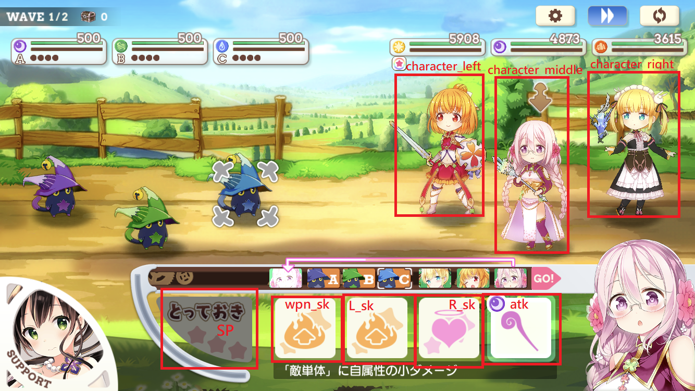

[](https://github.com/smallbomb/kirafan-bot/blob/master/LICENSE)
[](https://github.com/smallbomb/kirafan-bot/graphs/commit-activity)
[](https://github.com/smallbomb/kirafan-bot/releases)

# Kirafan-bot on emulator
Social game [kirarafantasia](https://kirarafantasia.com/) bot. Automatic training skills or sp(とっておき) level. Kirafan Bot is like auto click tool.

[kirarafantasia遊戲](https://kirarafantasia.com/)機器人。可自動練技能，類似按鍵精靈。


# Feature
1. 針對性練技(芳文跳、武器...等)
2. 刷簡易關卡 (手順不會變化的關卡)
3. 自動續關
4. 自動使用回體道具
5. 可設定當天暫停時間(如:AM:03:50-04:01暫停bot)
6. 偵測session clear
7. 偵測作品珠任務
8. 偵測遊戲crash，並嘗試回到戰鬥中 (**Note: 如果戰鬥結束時發生時，則無法回復**)


# Frequently used quest
* [○○修練場](https://wiki.kirafan.moe/#/questlibrary/3502) (**recommend**👍)
* [ゆゆ式 (作家クエスト)](https://wiki.kirafan.moe/#/quest/5004290)
* [New Game (作家クエスト)](https://wiki.kirafan.moe/#/quest/5001270)
* [外傳14-15節](https://wiki.kirafan.moe/#/quest/1108640)
* [6-31](https://wiki.kirafan.moe/#/quest/1106310)
* [8-26(rank up)](https://wiki.kirafan.moe/#/quest/1108261)
* [チノ專武關卡](https://wiki.kirafan.moe/#/quest/43001200)

可參考[おすすめスキル上げ](https://wikiwiki.jp/kirarafan/%E3%81%8A%E3%81%99%E3%81%99%E3%82%81%E3%82%B9%E3%82%AD%E3%83%AB%E4%B8%8A%E3%81%92)說明


# Installation
windows 使用者可以[**點擊這裡**](https://github.com/smallbomb/kirafan-bot/releases)下載exe檔案來使用  
#### or
Python version >= 3.8  
download [**source code**](https://github.com/smallbomb/kirafan-bot/releases)
```
pip install -r requirements.txt
py src
```

# Kirafan-bot hotkey
* z+1~z+9 (record position and rgb)
* z+r (run/resume bot)
* z+s (stop bot)
* z+o (stop bot after current battle is completed)
* z+l (bot_setting.json reload)
* z+m (monitor mode)
* z+t (test objects and icons exist?)
* z+p (print position01~09)
* z+c (check/add icon file)
* z+x (open/close game region checking) --for windows system
* z+k (switch adb/pyautogui mode)

# How to use?
## step1
windows使用者可以用`z+x`叫出一個綠色框矩陣，接著將遊戲視窗調整到接近綠色框大小  
ex:

**又或者**  
先將bot_settion.json的game_region設為[0, 0, 1, 1]  
再開啟exe程式，透過內建的互動式教學來設定game region  
ex:

## step2
建議遊戲內的戰鬥設定如下

## step3
根據個人需求編輯[bot_setting.json](#bot_settingjson-description)
## step4
開啟exe後，按下熱鍵
* `z+r` (run bot)

# bot_setting.json description
一般使用者需要會改的設定
* (一開始) game_region 的值
* (主要)   questList的內容，提供了範本('example', '8-26', 'event')，可供參考
* (進階)   支援adb工具，關於adb可參考[這裡](#support-adb-tool)
```js
{
  "loglevel": "info",                  // 可以設定loglevel: debug, info, warning, error, critical。**更改設定時需要重新啟動bot程式才會生效**
  "img_dir": "img_1274x718",           // 判斷圖片的素材位置 (目前比較適用於1274x718 遊戲視窗大小)
  "game_region": [0, 41, 1274, 718],   // 設定遊戲區域，不滿意可以設定[0,0,1,1]後重新調整(執行kirafan-bot有互動教學)
                                       // 若重新啟動，1274x718的圖片可能不適用，需換一個img_dir，並重新shotscreen(執行kirafan-bot有互動教學(z+c))
  "aspect_ratio": "16:9",              // 模擬器視窗比例
  "confidence": 0.92,                  // 圖片的相似度調整(0.0~1.0)越高代表判斷門檻越高，可參考opencv document
  "crash_detection": false,            // 是否偵測遊戲 crash? 若是，則嘗試回到戰鬥中 (可能需要app icon，設true請按z+c(hotkey)抓取。抓取範例大小可參考img_1274x718)
  "adb": {
    "use": false,                      // 使用adb?
    "path": "C:\\path\\adb.exe",       // adb.exe的路徑 
    "serial": "emulator-5554",         // use device with given serial
    "emulator_resolution": [1280, 720] // 模擬器的解析度，請查看自身使用的模擬器解系度 (目前img_1274x718內的素材適用於1280x720)
  }
  "set_timer": {                       // 定時器
    "use": false,                      // 是否用定時器?
    "pause_range": "02:50:00-03:01:00" // bot暫停運作區間
  },
  "sleep": {                           // 延遲時間(s) 根據電腦效能可調整，會導致bot判斷上變快或變慢(不一定)
    "click": 0.2,                      // 滑鼠click延遲時間(建議>=0.2)
    "sp": 7,                           // 芳文跳(とっておき)延遲時間
    "loading": 9,                      // 接關時的延遲時間。
    "wave_transitions": 2              // 切換場景的延遲時間。
  },
  "questList": {
    "quest_selector": "example",         // 選擇哪一個quest_name (依照範例目前有: example, 8-26, event。**使用者可以自行按照格式增加**)
    "example": {                         // quest_name (可任意取名)
      "loop_count": 30,                  // loop幾次 (不包含當前回合)
      "crea_stop": false,                // 遇到作品珠任務時是否要停止bot

      "friend_support": {                // 好友支援 (option.)
        "use": false,                    // 是否使用?
        "wave_N": 1,                     // 第幾個wave使用
        "myturn": 0,                     // 我方的第幾回合? (從0開始)
        "replace": "character_middle"    // 取代我方的哪一個角色
      },

      "stamina": {                       // 回復道具 (option.)
        "use": true,                     // 是否使用?
        "priority": ["Cu:7", "Ag", "Au"] // 銅:Cu, 銀:Ag, 金:Au。 Cu:7表示一次使用7個銅錶，用':'符號來區隔數量。(預設數量1個) **一次只使用一種類型的錶，當優先度高的用完才會換優先度低的錶
      },

      "orb": {                           // orb skills (option.)
        "orb_name": "ゆゆ式",             // 名稱 (使用者紀錄用的，可以隨便取名)
        "1": {"use": true, "wave_N": 1, "myturn": 0, "target": "N"}, // wave_N: 哪一個wave使用
        "2": {"use": true, "wave_N": 1, "myturn": 0, "target": "N"}, // myturn: 我方的第幾回合? (從0開始)
        "3": {"use": false, "wave_N": 1, "myturn": 0, "target": "N"} // target: 施放對象'A', 'B', 'C' or 'N'(no target)
      },

      "wave": {
        "total": 3,                   // 此關有幾個wave
        "1": {                        // wave1的戰鬥模式
          "auto": true                // 是否全自動?
        },
        "2,3": {                      // wave2、wave3的戰鬥模式 (可用','連接)
          "auto": false,          
          "sp_weight_enable": true,   // 是否依照sp的權重(sp_weight)來分配sp使用。若否，則有sp時直接使用且不保留sp能量。
          "character_left": {         // 角色(左)
            "skill_priority": ["sp", "normal_atk"], // 技能施放優先順序 sp > normal_atk
            "sp_weight": 9                          // 權重越高，代表sp使用比例越高 (相對於另外2隻角色)
          },
          "character_middle": {       // 角色(中)
            "skill_priority": ["sp", "weapon_sk", "sk2", "sk1", "normal_atk"], // 技能施放優先順序 sp > weapon_sk > sk2 > sk1 > normal_atk
            "sp_weight": 2
          },
          "character_right": {        // 角色(右)
            "skill_priority": ["sk2"] // 技能施放優先順序 sk2 > auto_button。 **如果沒有normal_atk則會使用auto_button**
          }
        }
      }
    },
    "8-26": {                         // 8-26範例
      "loop_count": 100,
      "crea_stop": true,
      "stamina": {
        "use": true,
        "priority": ["Au"]
      },
      "wave": {
        "total": 1,
        "1": {
          "auto": true
        }
      }
    },
    "event": {                       // event範例
      "loop_count": 50,
      "crea_stop": false,
      "orb": {
        "orb_name": "まほうつかい",
        "3": {"use": true, "wave_N": 2, "myturn": 0, "target": "C"}
      },
      "wave": {
        "total": 3,
        "1,2,3": {
          "auto": false,
          "character_left": {
            "skill_priority": ["sp", "weapon_sk", "sk2", "sk1"]
          },
          "character_middle": {
            "skill_priority": ["weapon_sk", "normal_atk"]
          },
          "character_right": {
            "skill_priority": ["weapon_sk", "sk1", "sp", "sk2", "normal_atk"]
          }
        }
      }
    },
    "user_defined": {                // you can try to add and modify it
      "total": 3,
      "1,2,3": {
        "auto": false,
        "character_left": {
          "skill_priority": []
        },
        "character_middle": {
          "skill_priority": []
        },
        "character_right": {
          "skill_priority": []
        }
      }
    }
  },
  "ratio": { // 主要用於開發者or需要更換比率的使用者
    "16:9": { // 模擬器16:9解析度
      // x,y 是座標在模擬器中的相對位置 (可用快捷建z+m或z+1~9偵測或紀錄)
      "focus_ch_left": {"x":0.64460, "y":0.19032, "color":"bronze", "owner": ["character"]},
      "focus_ch_middle": {"x":0.77902, "y":0.26545, "color":"bronze", "owner": ["character"]},
      "focus_ch_right": {"x":0.91242, "y":0.19032, "color":"bronze", "owner": ["character"]},
      "auto_button": {"x":0.93279, "y":0.03636, "color":"blue", "owner": ["wave", "character"]},
      "normal_atk": {"x":0.73906, "y":0.89722, "color":"ivory", "owner": ["character"]},
      "sk1": {"x":0.64634, "y":0.78623, "color":"ivory", "owner": ["character"]},
      "sk1_cd": {"x":0.64634, "y":0.78623, "color":"flash_green", "owner": ["character"]},
      "sk2": {"x":0.54065, "y":0.78623, "color":"ivory", "owner": ["character"]},
      "sk2_cd": {"x":0.54065, "y":0.78623, "color":"flash_green", "owner": ["character"]},
      "weapon_sk": {"x":0.46824, "y":0.78457, "color":"ivory", "owner": ["character"]},
      "weapon_sk_cd": {"x":0.46824, "y":0.78457, "color":"flash_green", "owner": ["character"]},
      "sp": {"x":0.33536, "y":0.84782, "color":"ivory", "owner": ["character"]},
      "sp_ch1": {"x":0.78986, "y":0.20257, "color":"None", "owner": ["character"]},
      "sp_ch1_set": {"x":0.51177, "y":0.13510, "color":"light_green", "owner": ["character"]},
      "sp_submit":{"x":0.83333, "y":0.90354, "color":"None", "owner": ["character"]},
      "sp_cancel":{"x":0.17668, "y":0.94968, "color":"ivory", "owner": ["character"]},
      "sp_charge2":{"x":0.31476, "y":0.87465, "color":"zinc_yellow", "owner": ["character"]},
      "setting_button": {"x":0.81455, "y":0.05161, "color":"ivory", "owner": ["wave"]},
      "stamina_Au": {"x":0.26545, "y":0.38835, "color":"light_khaki", "owner": ["bot"]},
      "stamina_Ag": {"x":0.26727, "y":0.54693, "color":"light_khaki", "owner": ["bot"]},
      "stamina_Cu": {"x":0.26364, "y":0.70874, "color":"light_khaki", "owner": ["bot"]},
      "stamina_add": {"x":0.63091, "y":0.41100, "color":"spring_green", "owner": ["bot"]},
      "stamina_hai": {"x":0.54069, "y":0.89068, "color":"ivory", "owner": ["bot"]},
      "center": {"x":0.5, "y":0.5, "color":"None", "owner": ["bot", "character"]},
      "center_left": {"x":0.03, "y":0.6, "color":"grey", "owner": ["bot"]},
      "friend": {"x":0.11695, "y":0.79109, "color": "ivory", "owner": ["wave"]},
      "friend_replace_left": {"x":0.61146, "y":0.44847, "color": "None", "owner": ["wave"]},
      "friend_replace_middle": {"x":0.74568, "y":0.52786, "color": "None", "owner": ["wave"]},
      "friend_replace_right": {"x":0.87912, "y":0.44847, "color": "None", "owner": ["wave"]},
      "friend_ok": {"x":0.84929, "y":0.93315, "color": "ivory", "owner": ["wave"]},
      "orb_entrypoint": {"x":0.88854, "y":0.83008, "color": "None", "owner": ["orb"]},
      "orb_cancel": {"x":0.17739, "y":0.94708, "color": "ivory", "owner": ["orb"]},
      "orb_option1": {"x":0.71272, "y":0.45125, "color": "ivory", "owner": ["orb"]},
      "orb_option2": {"x":0.71272, "y":0.66017, "color": "ivory", "owner": ["orb"]},
      "orb_option3": {"x":0.71272, "y":0.86908, "color": "ivory", "owner": ["orb"]},
      "orb_option_submit": {"x":0.56044, "y":0.65181, "color": "None", "owner": ["orb"]},
      "orb_targetA": {"x":0.38148, "y":0.45125, "color": "None", "owner": ["orb"]},
      "orb_targetB": {"x":0.50392, "y":0.50139, "color": "None", "owner": ["orb"]},
      "orb_targetC": {"x":0.61538, "y":0.50418, "color": "None", "owner": ["orb"]},
      "orb_target_cancel": {"x":0.56044, "y":0.65181, "color": "None", "owner": ["orb"]}
      "home_page": {"x":0.19074, "y":-0.02228, "color": "None", "owner": ["bot"]}
    },
    "4:3": { // 4:3解析度。
             // 目前沒有實作，可參考16:9來增加，若使用4:3則"aspect_ratio"記得要改
             // 主要修改x,y即可，其它請複製原本16:9的內容
      "focus_ch1": {"x":0.1234, "y":0.1234, "color":"bronze", "owner": ["character"]}
    }
  },
  "color": {
    "ivory": {                 // color name
      "rgb": [250, 250, 235],  // rgb value
      "tolerance": 25          // rgb色差門檻(越高代表顏色差異可以越大)，可參考opencv document
    },
    "flash_green": {
      "rgb": [129, 225, 117],
      "tolerance": 35
    },
    "blue": {
      "rgb": [77,141,225],
      "tolerance": 25
    },
    "light_khaki": {
      "rgb": [255,229,185],
      "tolerance": 25
    },
    "spring_green": {
      "rgb": [1,206,120],
      "tolerance": 25
    },
    "bronze": {
      "rgb": [182, 133, 88],
      "tolerance": 25
    },
    "grey": {
      "rgb": [127, 127, 127],
      "tolerance": 15
    },
    "light_green": {
      "rgb": [6, 227, 209],
      "tolerance": 20
    },
    "zinc_yellow": {
      "rgb": [255, 204, 0],
      "tolerance": 25
    }
  }
}
```
遊戲內技能或角色簡稱:


# Support adb tool
* [**about adb**](https://developer.android.com/studio/command-line/adb)
* [**download page**](https://developer.android.com/studio/releases/platform-tools)
* [**how to get device serial number**](https://developer.android.com/studio/command-line/adb#directingcommands)

# Major 3rd party library
* [**keyboard**](https://pypi.org/project/keyboard/)
* [**PyAutoGUI**](https://pypi.org/project/PyAutoGUI/)
* [**openCV**](https://pypi.org/project/opencv-python/)

# Question or Suggestion👍
有任何問題或想法可以[**直接發問**](https://github.com/smallbomb/kirafan-bot/issues)，或者私訊息到twitter帳號@rockon590

if any question which is usage, bot description or idea, you can open a [**new issue**](https://github.com/smallbomb/kirafan-bot/issues) or send message to me (Twitter account: @rockon590)

**Support language: Chinese, English, Japanese** 
